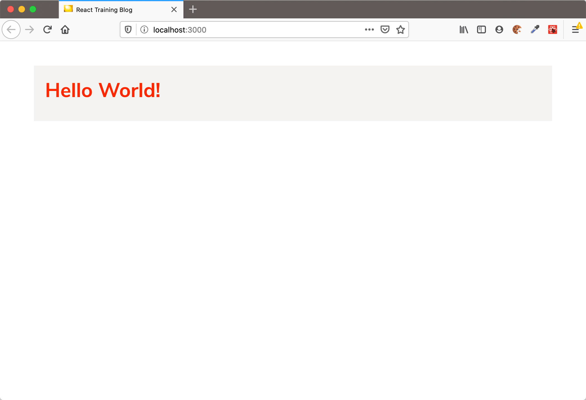

# Vorbereitungen für die React Online Schulung

## Voraussetzungen

Um sicherzustellen, dass der Workspace bei dir funktioniert, möchte ich dich bitten, schon im Vorfeld die hier beschriebene Installation durchzuführen.

> [!IMPORTANT]  
> Auch wenn du den Workspace schon vor der Schulung installierst, stelle bitte sicher, dass dein Computer auch _während_ des Workshops Zugriff auf das Internet hat. Du solltest in der Lage sein, von GitHub Repositories zu klonen bzw. updates zu machen (git pull) und npm Pakete zu installieren. (Hindernisse können hier zum Beispiel VPNs, Firewalls, Firmen-Proxy oder -Sicherheitsrichtlinien sein)


**Für dein Laptop/PC**

Auf deinem Computer benötigst Du folgende Software:

- Git (zum klonen und aktualisieren des Workspaces)
- Node.js (mind. Version 18)
- Einen Node Package Manager (zum Beispiel npm)
- Browser (am besten Firefox oder Chrome)
- Eine IDE oder ein Texteditor. Wenn Du bereits einen "Lieblingseditor" verwendest, benutze diesen während des Trainings, damit Du nicht auch noch ein neues Tool lernen musst. Ansonsten funktionieren folgende Tools zum Beispiel:
  - [Visual Studio Code](https://code.visualstudio.com/)
  - [Webstorm](https://www.jetbrains.com/webstorm/download/) (Evaluationsversion reicht)
  - [IntelliJ IDEA](https://www.jetbrains.com/idea/download/) (Ultimate Edition, Evaluationsversion reicht aber)

**Optional: Browser Erweiterungen für React**

- Für das Arbeiten mit React empfehle ich, die [React Developer Tools](https://github.com/facebook/react/tree/master/packages/react-devtools) zu installieren. Es gibt sie für [Chrome/Edge](https://www.google.com/url?sa=t&rct=j&q=&esrc=s&source=web&cd=1&cad=rja&uact=8&ved=2ahUKEwjE14vhq-rmAhVGblAKHbgOC1sQFjAAegQICRAK&url=https%3A%2F%2Fchrome.google.com%2Fwebstore%2Fdetail%2Freact-developer-tools%2Ffmkadmapgofadopljbjfkapdkoienihi&usg=AOvVaw3YJDg7kXgeeChgKN88s0Sx) und [Firefox](https://addons.mozilla.org/de/firefox/addon/react-devtools/). Für den Workshop sind die Developer Tools nicht notwendig.

**Während des Trainings**

- Da wir vor und während des Trainings ggf. noch Aktualisierungen installieren müssen, bitte sicherstellen, dass auch während des Trainings auf deinem Computer der Internet-Zugang (logisch, online-Schulung 🙃) funktioniert.
  - Bitte stelle sicher, dass das Installieren von npm-Paketen und das Klonen von Git-Repositories **auch während der Schulung** funktioniert
  - Dazu kontrollieren, dass keine Proxy, VPN- oder Firewall- oder andere Einstellungen den Zugang zu Git und npm verhindern.
  - Informationen zum Einrichten eines Proxies für npm findest Du bei Bedarf [zum Beispiel hier](http://wil.boayue.com/blog/2013/06/14/using-npm-behind-a-proxy/).
- **Lass während des Trainings deine Kamera an!**. Ich kann sonst nur schwer einschätzen, ob ich euch langweile oder euch vielleicht abgehängt habe. Und wir sind ja nicht im Radio 😉
  - Dein Mikrofon brauchst Du nur anmachen, wenn Du etwas sagen oder fragen möchtest (was Du natürlich jederzeit darfst!)
- W-LAN ist bequem, aber gerade bei (langen) Streamings ist ein Kabel-gebundenes Netzwerk stabiler als W-LAN, also im Zweifel lieber das Kabel einstecken (und W-LAN deaktivieren) 😊

# Installation und Vorbereitung des Workspaces für die Schulung

Damit wir sicher sind, dass während des Workshops alles funktioniert, möchte ich dich bitten, im Vorweg schon einmal die folgenden Schritte durchzuführen, auch wenn es während des Workshops möglicherweise noch ein Update gibt (deswegen bitte sicherstellen, dass git und npm auch _während_ des Workshops funktionieren).


## Schritt 1: Repository klonen und Pakete installieren

1. Das Repository klonen:

```
git clone https://github.com/nilshartmann/react18-workshop
```

2. Die benötigten npm-Pakete installieren:

```
cd react-intro/backend
npm install

cd react-intro/workspace
npm install

```

## Schritt 2: Testen, ob REST-Backend funktioniert

1. Im Verzeichnis **react-intro/backend** des Repositories das Backend starten:

```
cd react-intro/backend
npm start
```

Achtung! Das Backend läuft auf **Port 7000**, d.h. dieser Port muss verfügbar sein.

2. Backend testen

- Im Browser (oder per `curl`, `wget`, Postman o.ä.) aufrufen: http://localhost:7000/posts
- Dort sollte JSON Code zurückkommen

## Schritt 3: Testen, ob das Frontend funktioniert

1. Frontend (Beispiel-Anwendung) starten

Dazu in das Verzeichnis `react-intro/workspace` wechseln und `npm run dev` ausführen:

```
cd react-intro/workspace

npm run dev
```

Achtung! Das Frontend läuft auf **Port 3000**, d.h. dieser Port muss verfügbar sein.

2. Wenn das Frontend gestartet ist, zum testen einmal die Anwendung im Browser aufrufen: [http://localhost:3000](http://localhost:3000). Dort sollte "Hello, World" erscheinen, dann ist der Workspace einsatzbereit.



**Das ist alles 😊**

Bei Fragen oder Problemen melde dich gerne bei mir.
